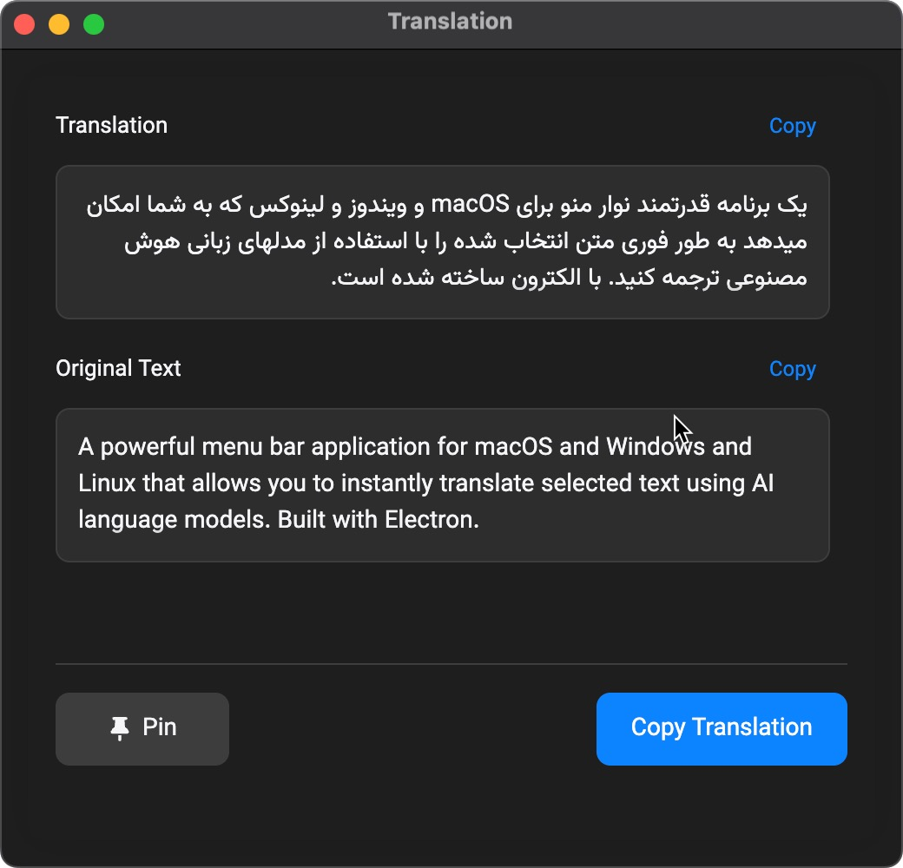

# Pro Translator

A powerful cross-platform application for macOS, Windows, and Linux that allows you to instantly translate selected text and optimize sentences using AI language models. Built with Electron.

**Current Version: 2.0.0**



## Features

- **Quick Translation**: Translate selected text from any application with a customizable keyboard shortcut
- **Sentence Optimization**: Improve sentence structure and readability with AI-powered optimization
- **Support for Multiple Languages**: Translate to Persian, English, and more languages
- **AI-Powered Translation**: Uses advanced AI models through OpenRouter API
- **Cross-Platform Support**: Available for macOS, Windows, and Linux
- **Menu Bar/System Tray Integration**: Stays in your menu bar or system tray for easy access
- **Text Selection Tools**: Select, copy, and save specific portions of translations
- **Dark Mode Support**: Seamlessly integrates with your system theme
- **Multiple Translation Methods**:
  - Keyboard shortcut (Control+Shift+Q on macOS, Control+Q on Windows)
  - Direct input through the "Translate Now" window
  - Menu bar/tray context menu

## Installation

### macOS
1. Download the latest `.dmg` file from the [Releases](https://github.com/yourusername/pro-translator/releases) page
2. Open the `.dmg` file and drag Pro Translator to your Applications folder
3. Open Pro Translator from your Applications folder
4. On first launch, you may need to allow accessibility permissions

### Windows
1. Download the latest `Pro Translator Setup 2.0.0.exe` from the [Releases](https://github.com/yourusername/pro-translator/releases) page
2. Run the installer and follow the on-screen instructions
3. Launch Pro Translator from the Start menu

### Linux
1. Download the latest `.AppImage` or `.deb` file from the [Releases](https://github.com/yourusername/pro-translator/releases) page
2. For AppImage:
   - Make the file executable: `chmod +x Pro_Translator-2.0.0.AppImage`
   - Run the AppImage: `./Pro_Translator-2.0.0.AppImage`
3. For Debian/Ubuntu:
   - Install the .deb package: `sudo dpkg -i Pro_Translator-2.0.0.deb`
   - Launch Pro Translator from your application menu

## Usage

### Setting up the API Key
1. Click on the "PT" icon in the menu bar/system tray
2. Select "Settings"
3. Enter your OpenRouter API key
4. Choose your preferred target language
5. Click "Save Settings"

You can get an API key from [OpenRouter](https://openrouter.ai/).

### Translating Text
1. Select text in any application
2. Press the keyboard shortcut (default: Control+Shift+Q on macOS, Control+Q on Windows)
3. A translation window will appear with the original and translated text
4. Use the "Copy Translation" button to copy the result to your clipboard

### Direct Translation
1. Click on the "PT" icon in the menu bar/system tray
2. Select "Translate Now"
3. Enter or paste text in the input field
4. Choose the target language
5. Click "Translate"

### Sentence Optimization
1. Click on the "PT" icon in the menu bar/system tray
2. Select "Translate Now"
3. Enter or paste text in the input field
4. Toggle on the "Optimize Sentence" option
5. Click "Translate" to get both translation and optimization

### Text Selection Features
- Select specific portions of the translated or original text
- Use the selection status bar to see character count
- Copy selected portions with one click
- Context menu support for additional options

## Development

### Prerequisites
- Node.js (v16 or later)
- npm

### Setup
1. Clone the repository
```bash
git clone https://github.com/yourusername/pro-translator.git
cd pro-translator
```

2. Install dependencies
```bash
npm install
```

3. Run the application in development mode
```bash
npm start
```

### Building
- Build for all platforms: `npm run build:all`
- Build for macOS: `npm run build:mac`
- Build for Windows: `npm run build:win`
- Build for Linux: `npm run build:linux`

## Technical Details

Pro Translator is built with:
- Electron
- Node.js
- Electron Store (for settings persistence)
- OpenRouter API for AI translation

The application interfaces with the clipboard to capture selected text and uses platform-specific methods to ensure proper text selection across different operating systems.

## License

This project is licensed under the MIT License - see the LICENSE file for details.

## Acknowledgements

- [OpenRouter](https://openrouter.ai/) for providing the AI translation API
- [Electron](https://www.electronjs.org/) for the cross-platform framework
- [Vazirmatn](https://github.com/rastikerdar/vazirmatn) font for Persian text rendering 